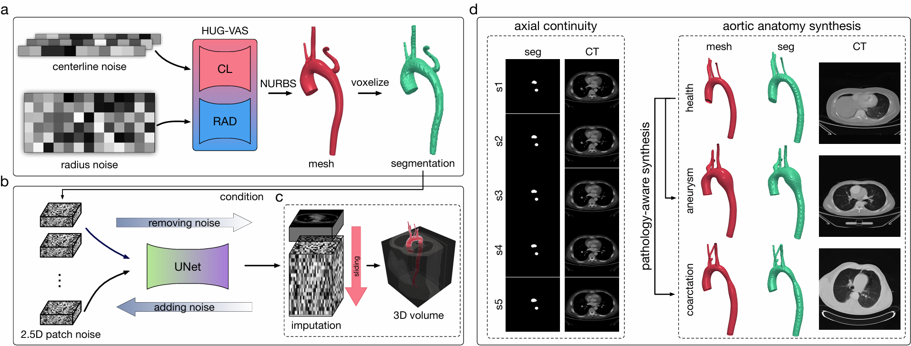

# SGADiff: A Segmentation-Guided 2.5D Diffusion Model for CT Volume Generation from Synthesized Aorta Meshes

<div align='center'>

</div>

## Introduction
**SGADiff** (Segmentation-Guided 2.5D Diffusion) is a framework for synthesizing realistic **3D aortic CT volumes** from synthetic aorta meshes.  
It addresses the scarcity of pathological imaging data (e.g., aneurysms, coarctations) by enabling controllable generation of both healthy and diseased CT scans.  

The pipeline has two main stages:
1. **Anatomical Priors** – Diverse aorta meshes are generated by **HUG-VAS** and voxelized into segmentation masks, explicitly encoding anatomical structures.  
2. **Segmentation-Guided Diffusion** – A **2.5D diffusion model** is trained to synthesize CT slices conditioned on masks. An imputation + sliding-window strategy ensures smooth continuity across axial slices during inference.  

SGADiff supports creating large-scale paired datasets (mesh, mask, CT) for **model training, validation, and clinical research**.

---

## Features
- 🫀 **Segmentation-Guided Conditioning**: Generates CT volumes directly from anatomical priors.  
- 🖼 **2.5D Diffusion**: Trains efficiently while preserving axial continuity.  
- 🔀 **Controllable Pathology Generation**: Healthy → Aneurysmal / Coarcted variants.  
- 📊 **Dataset Utility**: Outputs paired mesh, segmentation, and CT volumes for downstream tasks.  
- ⚡ **Lightweight Training**: 2.5D diffusion requires significantly less GPU memory than full 3D diffusion.  

---

## Installation
We recommend using **conda** for environment setup.

```bash
# Create environment
conda create -n sgadiff python=3.10
conda activate sgadiff

# Install dependencies
pip install -r requirements.txt
```

Key dependencies (see requirements.txt):
```bash
PyTorch >= 2.1

MONAI >= 1.4

Diffusers >= 0.21

SimpleITK, PyVista, tqdm, matplotlib
```

## Dataset Preparation

SGADiff expects data in NRRD format.
Use split_data.py to structure datasets into train/val/test:

```bash
./data/
│
├── img/
│   ├── train/
│   ├── val/
│   └── test/
└── seg/
    └── all/
        ├── train/
        ├── val/
        └── test/
```

Each case should include:
-Image volume: <case>.nrrd
-Segmentation mask: <case>.seg.nrrd

## Usage
1. Training
```bash
python main.py
```
Default settings are defined in `main.py` via `TrainConfig`.

2. Inference
```bash
python inference.py
```

Outputs generated volumes `(.npy and .nrrd)` to `results_output_dir`.

3. Examples
```python
We provided the healthy, aneurysmal, and coarcted cases in the data folder. Users can voxelize them and test the SGADiff. Due to the file size limitation, we are unable to upload the voxelized NRRD file.
```

## Code Structure
```php
SGADiff/
│── dataset.py         # Dataset loaders (2D, 2.5D, inference)
│── training.py        # Training loop
│── eval.py            # Evaluation + custom diffusion pipelines
│── inference.py       # Inference entry point
│── main.py            # Training entry point
│── utils_diff.py      # Config dataclass, utilities
│── split_data.py      # Dataset splitting utility
│── requirements.txt   # Dependencies
```


